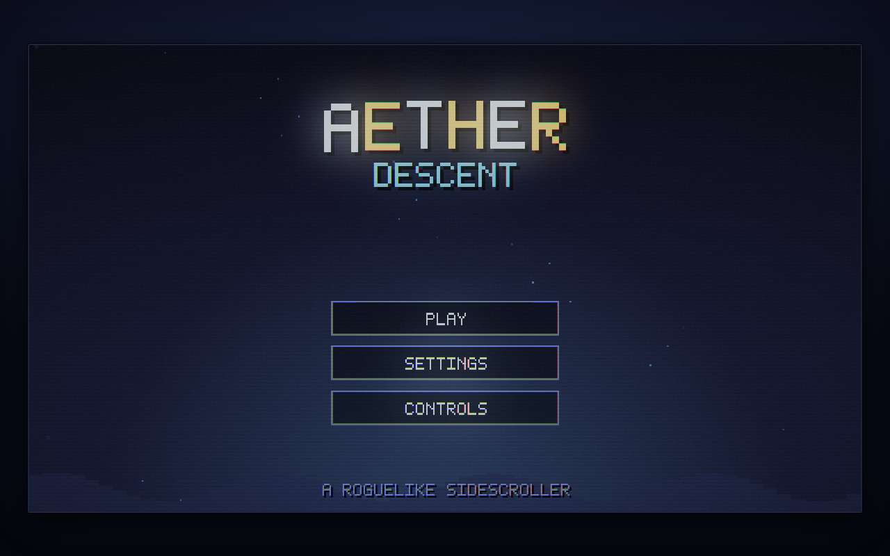
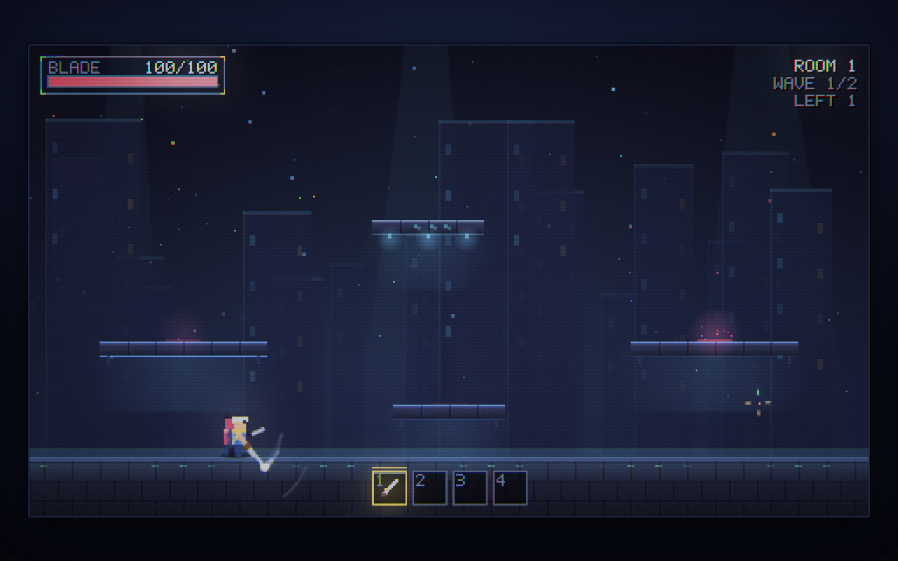
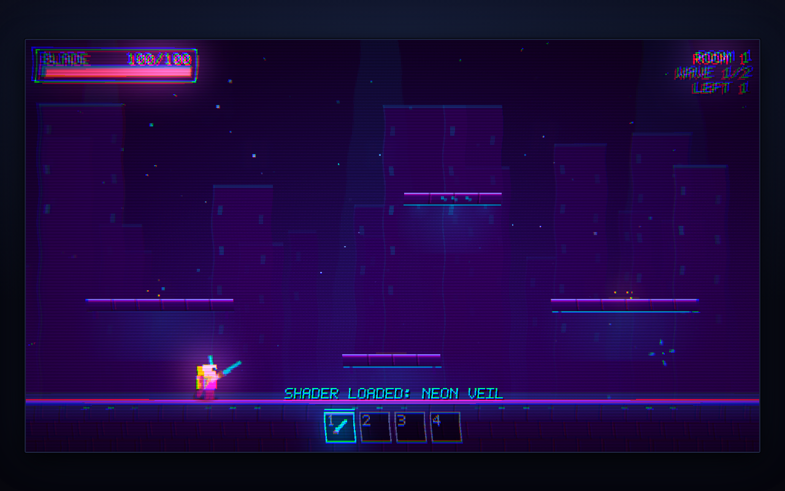

# Aether Descent

A pixel-art **roguelike sidescroller** that runs entirely in the browser — no
build step, no dependencies, no asset downloads. Every sprite, particle and
glyph is drawn procedurally at a 480x270 internal resolution and pushed through
a WebGL bloom pipeline, so the art stays crisp at any window size.

The presentation leans on motion rather than frame counts: characters squash and
stretch, cloth hangs off verlet chains, the blade leaves a tapered ribbon, hits
throw expanding rings and streak sparks, the camera punches inward on impact,
and the backdrop is a three-layer parallax skyline with light shafts, fog banks
and drifting embers.




## Play

Open `index.html` over HTTP (it uses ES modules, so `file://` won't work):

```sh
python3 -m http.server 8000
# then visit http://localhost:8000
```

### Deploy to GitHub Pages

The repository root *is* the site. In **Settings → Pages**, choose
*Deploy from a branch*, pick this branch and the `/ (root)` folder. A
`.nojekyll` file is included so nothing gets filtered out.

## Controls

| Input | Action |
| --- | --- |
| `A` / `D` | Move left / right |
| double-tap `A` / `D` | Dash in that direction (i-frames) |
| `W` | Jump |
| `S` | Drop through a platform |
| double-tap `S` in the air | Ground slam (25 damage AoE + shockwave) |
| Left click | Attack toward the cursor |
| Right click | Interact with what's under the cursor (loot, gate) |
| Scroll wheel / `1`-`4` | Change hotbar slot |
| `E` | Inventory |
| `R` | Reload the bow |
| `Q` | Fire the grappling hook (needs the item) |
| `Esc` | Pause |

Every key in that table except the mouse, the scroll wheel and `Esc` can be
**rebound** from Controls in the main menu — click a key, press the new one.
Assigning a key that is already taken swaps the two, and the mapping is saved
in `localStorage`.

There is one shortcut the game never mentions: **`Ctrl+M`** opens a debug menu
with god mode, infinite health, a spawner for every item in the game, a spawner
for every enemy and both bosses, full heal and kill-wave. It is
deliberately absent from the in-game Controls screen.

## Run structure

The arena has three static one-way platforms (left, right, and the raised
4-block platform at the bottom centre) plus a **drifting platform high in the
centre** that slides left and right and carries whatever is standing on it.

Each **room** runs **two waves**. The opening is a soft on-ramp — room 1 sends
one enemy then two, room 2 sends two then three — and from room 3 the normal
scaling takes over. Enemies materialise on the left-centre and
right-centre platforms; in wave 2 the raised 4-block platform at the bottom
centre activates as a third spawn pad. When wave 2 ends, a drop appears on that
centre platform — a perk 80% of the time, a **weapon** the other 20% (favouring
one you aren't already carrying, so it can open up the other playstyle) and a gate opens on the right — right-click the drop to take
it, right-click the gate to descend into the next room. Rooms get denser and
add new enemy types as you go.

Enemies keep their base stats through the first five rooms. From **room 6** they
step up **once every two rooms**: +18% max HP and +12% damage per step, so a
Ghoul is 80 HP / 12 damage until room 5, 94 / 13 in rooms 6–7, and 123 / 17 by
rooms 10–11.

You regenerate **1 HP per second** at all times. Clearing a wave restores **25%
of max HP**, stepping through the gate into the next room restores you to
**full HP**, and the boss wave in a boss room also starts you at full.

Nothing is announced. There are no banners, no wave-clear notifications and no
"press X to..." prompts — you find out what happened by watching the screen.
Reference information stays available where you go looking for it: the HUD
carries the wave and enemies-left counters, item tooltips describe their
effects, and the Controls screen sits in the main menu.

### Seeds

The class-select screen has a **seed** field. Type anything and the run's rooms,
wave composition, enemy types, spawn offsets and every drop roll replay exactly;
leave it blank and one is rolled for you. Purely cosmetic randomness (particles,
timing jitter) runs on its own unseeded stream, so it never desyncs a replay.
The death screen shows the seed and offers **Retry Seed** next to **New Seed**.

### Run summary

Dying opens a summary panel: class, room and wave reached, kills, run time, max
HP, the seed, and every item you were carrying (hover one for its tooltip).

### Boss rooms

Every **5th room** (5, 10, 15, …) runs a **third wave** instead of ending after
two, and holds its drop back for it. Wave 3 spawns a boss in the centre of the
arena. When it dies, **two perks** appear on the centre platform and you may
take **one** — the moment you claim one the other greys out for good.

**Aether Golem** (600 HP, +40% per boss room). Two phases sharing one pool:

It is a large target — a 48x60 body with a 32x27 head — and it waits **3
seconds between attacks**, so its openings are readable.

* *Phase 1* — head fused to the body. Loops: four small lasers 0.2s apart → one
  heavy beam that tracks your position with a 0.3s delay for 2s → a high jump
  into a ground slam.
* *Phase 2* (at 280 HP) — the head tears free over a second and a half: it
  strains and sinks in the socket, snaps loose in a burst of arcs, then climbs
  with an eased overshoot while a bolt still tethers it to the body. From then
  on it never parks — it sweeps, bobs and banks continuously, stalking you
  between orders, and only moves on the X axis. Its script continues (four small lasers → turn → 2s beam → 1s beam)
  while the body improvises underneath with high slams, quick slams and dashes,
  and charges in alongside the head's short beam.

**Big Dude** (600 HP, +40% per repeat appearance). A twenty-block worm that
lives under the floor. The head drives a path and every body segment trails it
by a fixed arc length, so the whole thing swims, erupts and dives as one curve —
and only the parts above the floor line can be hit or can hurt you (the head
hurts far more than the back). Its loop: buried 3s, leap, wait 2s, leap, wait
2s, leap + spit, buried 3s, spit + leap, wait 2s, repeat. The spit is a fan of
20 globs thrown up on their own arcs.

Boss rooms alternate between the two, and each boss scales from its own first
appearance, so a debut boss always fights at its listed stats.

### Boss cutscenes

Every boss gets an intro and an outro. The world keeps rendering underneath —
gameplay pauses, letterbox bars slide in, the camera pushes onto the boss, and
the name card wipes in on a light streak with its letters dropping one at a
time over a filling HP bar. Big Dude tears up out of the floor for its reveal
instead of sitting invisible underground. The outro walks a chain of
detonations along the body in slow motion, strikes the boss's name through and
stamps DEFEATED. The golem's outro tears its head free (even if it died in
phase 1), drops it, bounces it off the floor, settles it on its side and then
lets it crumble away the same way a spent arrow does. Any key skips after half
a second.

### Enemies

| Enemy | Behaviour | Damage |
| --- | --- | --- |
| Ghoul | Chases and swipes | 12 |
| Stinger | Flies, keeps distance, shoots | 10 |
| Brute | Slow, heavy, occasionally charges | 20 |
| Lurker | Circles at range, then commits to a long telegraphed lunge | 15 |
| Spitter | Holds a stand-off and lobs acid on a high arc | 16 |
| Shardling | Golem wreckage, from room 6. Hovers with its plate toward you, sights a line, then commits to one straight charge it cannot steer. The plate turns **75% of any frontal hit** — open it up from behind or above | 20 |

### Classes

| Class | Weapon | Numbers |
| --- | --- | --- |
| Melee | Iron Sword | 3-block reach, 10 damage, 0.45s swing |
| Ranger | Hunter Bow | 10-block range, 5 damage, 10 ammo, 2s reload, 0.4s between shots |

At the end of its 10 blocks an arrow does not blink out: it loses its drive with
a small puff, hitches upward, then tumbles down under gravity and plants itself
nose-first in whatever surface it lands on before fading. A spent arrow deals no
damage, so the bow's reach stays exactly 10 blocks.

Player HP is 100. Regular enemies have 80 HP and deal 10–20 damage depending on
type (Ghoul 12, Stinger 10 ranged, Brute 20).

### Nukerang

The first boss you kill always offers the **Nukerang** as its second choice —
once. Take it or leave it; if you already own one it never appears again, and
that slot goes back to a normal perk.

It is a thrown melee weapon. Left click hurls it five blocks out, it decelerates
into a turn, then homes back to your hand — while it is in the air your hands
are empty and you cannot throw again. Every enemy it passes through takes a
**small blast for 14**, and **every third blast** is a full detonation for **28**
over a much wider radius. The counter carries across throws, so you can line the
third one up.

### Perks

Perks are items — they work while they simply sit anywhere in the inventory.

| Item | Rarity | Effect |
| --- | --- | --- |
| Life Crystal | Common | +10 max HP each, effective up to 5 stacks (+50) |
| Fiery Blade | Common | Melee hits have a 33% chance to burn for 3s (-1 HP per 0.1s, non-stacking) |
| Lightning Arrow | Uncommon | Arrows mark enemies for 5s; with 2+ marks, arcs chain between them, damaging everything the arc crosses and applying *electrified* (-10 HP every 1.2–1.5s). **Bosses are immune** — they take no mark, never electrify, and the arc passes straight through them |
| Wet Slime | Uncommon | Every 2s spits a homing glob that slows the target 30% for 1.5s |
| Bloodstone | Common | Every 5th hit you land heals 3 HP (+2 per extra stack) |
| Aegis Shard | Uncommon | +20 absorb shield that soaks damage before your HP; refills 5s after you stop taking hits |
| Grappling Hook | Rare | `Q` fires a hook at the cursor. It bites terrain, reels you in on a rope you can swing from, and `Q` again lets go. One per run |

Inventory is a 4x4 grid (16 slots); the top row doubles as the hotbar. Non-weapon
items stack to 10, weapons don't stack. Drag items between slots with the mouse.

## Shader packs

**Settings → Load .shdr**, or drag a `.shdr` file onto the window. A pack can
carry a JSON `@theme` header that repaints every colour in the game plus the
bloom/scanline/animation knobs, and a GLSL fragment shader that replaces the
final composite pass outright — so a pack changes the whole look, not just a
filter. See [`shaders/README.md`](shaders/README.md) for the format and the
uniforms, and the three included samples (`neon-veil`, `gameboy`, `crt-amber`).



If a pack's GLSL fails to compile it is rejected and the error is shown in
Settings; the built-in shader keeps running. If WebGL is unavailable the game
falls back to a plain scaled blit and stays playable.

## Layout

```
index.html          entry point
css/style.css       page frame
js/config.js        arena geometry + every tuning number
js/game.js          main loop, run/room/wave state machine
js/entities.js      player, enemies, projectiles, status effects
js/world.js         backdrop, platforms, pickups, gate, wave composer
js/items.js         item defs + inventory model
js/postfx.js        WebGL bloom pipeline + .shdr loader
js/gfx.js           camera shake, particles, combat text, draw helpers
js/ui.js            HUD, hotbar, inventory, tooltips
js/screens.js       menu, settings, class select, pause, death
js/font.js          5x7 bitmap font
js/input.js         keyboard/mouse + double-tap detection
js/audio.js         procedural sound effects
js/theme.js         palette (overridable by shader packs)
shaders/            sample .shdr packs
```
